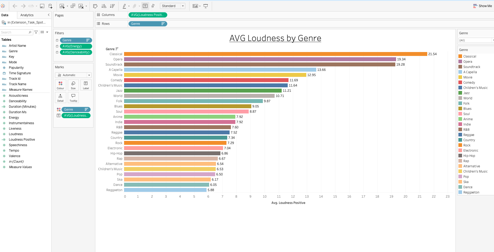

# 🎧 Tableau-Spotify-Project

## 📌 Overview
This project analyzes Spotify track data using **Tableau** to explore patterns in loudness, energy, danceability, popularity, and other audio features.

The goal is to understand how musical characteristics vary across genres and to visualize trends that define the structure and emotion of modern music.

👉 **View the full interactive dashboard on Tableau Public:**  

---

## 📂 Dataset
The dataset includes the following fields:

### 🎵 **Track Information**
- Artist Name  
- Track Name  
- Genre  
- Popularity  

### **Audio Features**
- Danceability  
- Energy  
- Loudness  
- Acousticness  
- Speechiness  
- Instrumentalness  
- Liveness  
- Valence  
- Tempo  
- Duration (ms)

These variables highlight the musical and acoustic profile of each track.

---

## 📊 Visualizations

### **1️⃣ Average Loudness by Genre (Bar Chart)**
A horizontal bar chart showing which genres have the highest and lowest average loudness.  
This helps identify genres with more dynamic energetic sound.

📸  

---

### **2️⃣ Popularity vs Energy & Danceability (Packed Bubbles)**
This packed bubble visualization explores the relationship between popularity, energy, and danceability.  
Each bubble represents a genre or track category, making it easy to spot patterns and outliers.

📸  

![Popularity vs Energy and Danceability]

---

### **3️⃣ Most Popular Tracks (Side-by-Side Bars)**
A side-by-side bar chart comparing the most popular tracks in the dataset.  
This chart highlights which songs stand out based on Spotify popularity.

📸  

![Top Genres by Popularity]

---
## 🎛️ Dashboard Interactivity
To enhance the user experience, the dashboard includes:
- **Filters** for genre, energy, danceability, popularity  
- **Range sliders** for continuous variables  
- **Highlight actions** to focus on selected genres or tracks  
- **Interactive legends** to isolate categories  

These features make it easier to explore trends and compare categories dynamically.

## 🧠 Key Insights
- Genres such as **Classical**, **Opera**, and **Soundtrack** exhibit the **highest loudness averages**.  
- **Pop**, **Electronic**, and **Dance** genres tend to cluster together with **high energy and high danceability**.  
- A high-energy track is not always highly popular, suggesting popularity depends on a mix of acoustic and non-acoustic features.  
- The distribution of popularity is diverse, with several outliers that outperform their genre averages.

---

## 🛠 Tools Used
- **Tableau Desktop** - Data visualization & dashboard creation  
- - **Tableau Public** – Dashboard publishing  
- **Spotify Dataset (CSV / Excel)** – Audio features and metadata 

---

## 🚀 How to Access the Dashboard
1. Click the link above to access the Tableau Public dashboard.  
2. Use the filters to explore genres, popularity levels, or specific audio features.  
3. Interact with the charts to highlight and compare insights.

## 👩‍💻 About This Project
This project was created as part of a data visualization and analytics exercise focused on exploring musical trends using Spotify data.  
It demonstrates skills in:
- Data cleaning  
- Visual analytics  
- Dashboard design  
- Insight communication  

---
